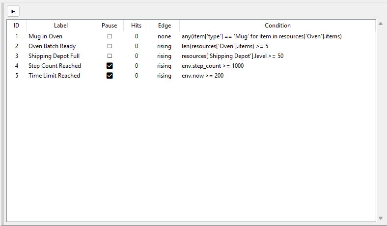
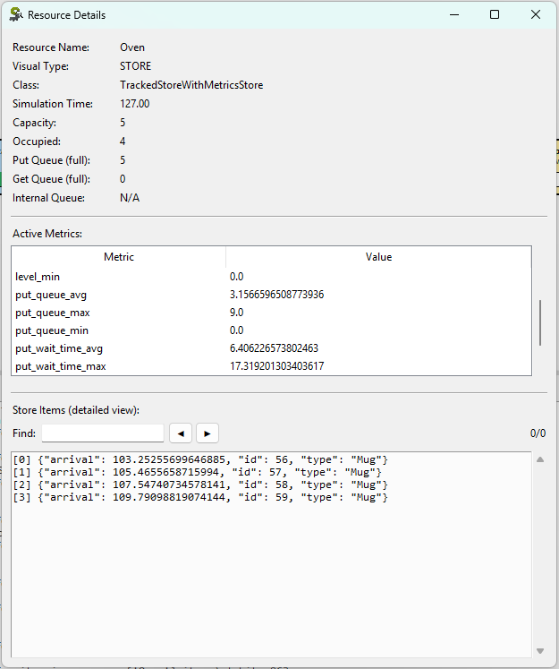
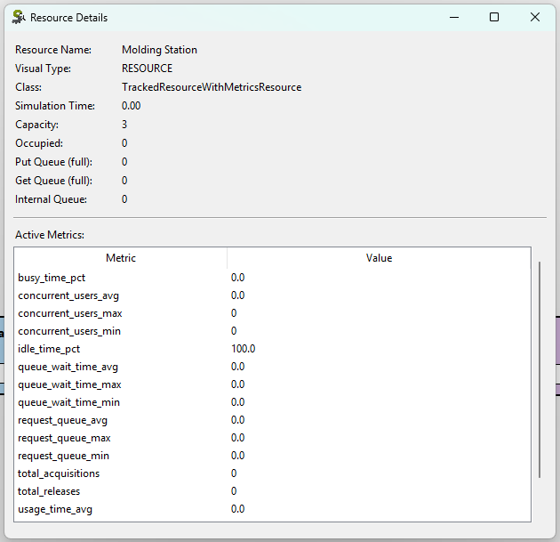

# SimpyLens: SimPy Visualization and Debugging Toolkit for Discrete-Event Simulation

[](https://pypi.org/project/simpylens/)
[](https://pypi.org/project/simpylens/)
[](LICENSE)

SimpyLens is a zero-invasion toolkit for **SimPy model visualization, simulation debugging, and runtime inspection**. It helps you understand queueing behavior, resource contention, and process flow in real time, without rewriting your simulation business logic.

It is designed for developers, researchers, and operations teams building **discrete-event simulation in Python** with SimPy.

## Table of Contents

- [Why SimpyLens](#why-simpylens)
- [SimPy Visual Demos and Screenshots](#simpy-visual-demos-and-screenshots)
- [Key Features](#key-features)
- [Installation](#installation)
- [Quick Start (GUI)](#quick-start-gui)
- [Quick Start (Headless for tests/CI)](#quick-start-headless-for-testsci)
- [Public API](#public-api)
- [Breakpoints](#breakpoints)
- [Logs and Event Schema](#logs-and-event-schema)
- [Metrics](#metrics)
- [User Interface Guide](#user-interface-guide)
- [SimPy Examples Included](#simpy-examples-included)
- [Project Metadata](#project-metadata)
- [Limitations](#limitations)
- [FAQ](#faq)
- [Contributing](#contributing)
- [Credits](#credits)
- [License](#license)

## Why SimpyLens

- Real-time visualization of SimPy resources and process interactions.
- Interactive debugger UI for play, pause, step, reset, and speed control.
- Breakpoint engine with expression/callable conditions, edge modes, and pause behavior.
- Structured event logs for simulation, resources, step lifecycle, and breakpoints.
- Headless mode for automated tests and CI usage.
- Metrics patch for queue wait, usage time, levels, and throughput indicators.

## SimPy Visual Demos and Screenshots

This section gives a guided visual tour of SimpyLens for **discrete-event simulation debugging** in real projects.
The media below are ordered from high-level interface overview to focused inspection panels.

### 1) Full Interface Overview (Pottery Factory)


`assets/pottery_factory_18fps.gif` shows the main SimpyLens workflow in the pottery example:
- simulation execution controls
- real-time resource blocks and flow
- breakpoint monitoring behavior
- live resource metrics and runtime inspection context

It is the visual summary of the full SimpyLens interface in action.

### 2) Manual Resource Layout System


`assets/manual_layout_18fps.gif` demonstrates how to manually position resource blocks to match your mental model or presentation needs.
This is especially useful when you want clearer storytelling of process flow during debugging or demos.

### 3) Breakpoint Management Panel (Pottery Example)



`assets/pottery_breakpoints.png` is a focused screenshot of the Breakpoint panel, showing:
- conditional breakpoint expressions
- per-breakpoint pause behavior
- hit counters
- edge modes (`none`, `rising`, `falling`)

### 4) Resource Details Window: Store



`assets/store_details.png` shows the details window for a `Store`, including runtime metrics, queue state, and detailed item inspection.
This view helps identify stock/backlog bottlenecks in storage-like resources.

### 5) Resource Details Window: Resource



`assets/resource_details.png` shows the details window for a `Resource`, focused on utilization and waiting-time metrics.
This view supports performance diagnostics for worker/machine-style constrained resources.

## Key Features

### SimPy Resource Visualization

SimpyLens tracks and renders:
- `Resource`
- `PriorityResource`
- `PreemptiveResource`
- `Container`
- `Store`
- `PriorityStore`
- `FilterStore`

### Runtime Controls and Debugging

- Play, step, pause, reset.
- Simulation speed slider.
- Event timeline logs with search.
- Breakpoint panel with live hit count and per-row `pause_on_hit` toggle.

### Advanced Breakpoints for Simulation Analysis

- Condition types: Python expression (`str`) or callable.
- Edge modes: `none`, `rising`, `falling`.
- Pause behavior: pause or continue on hit.
- Multiple breakpoint hits in the same simulation step are all counted and logged.

## Installation

### Requirements

- Python `>=3.8`
- `simpy>=4.0.0`
- Tkinter available in your Python installation for GUI mode

### Install from source

```bash
pip install .
```

### Development install

```bash
pip install -e .
```

## Quick Start (GUI)

```python
import simpy
import simpylens


def setup(env):
    machine = simpy.Resource(env, capacity=2)

    def worker(name):
        while True:
            with machine.request() as req:
                yield req
                yield env.timeout(2)

    env.process(worker("A"))
    env.process(worker("B"))


lens = simpylens.Lens(model=setup, title="SimPy Machine Shop", gui=True, metrics=True, seed=42)
lens.show()
```

## Quick Start (Headless for tests/CI)

```python
import simpy
import simpylens


def setup(env):
    server = simpy.Resource(env, capacity=1)

    def client():
        with server.request() as req:
            yield req
            yield env.timeout(5)

    env.process(client())


lens = simpylens.Lens(model=setup, gui=False)
lens.add_breakpoint("env.now >= 5", label="Done", pause_on_hit=True)
lens.run()
print(lens.get_logs())
```

## Public API

Main exports:
- `simpylens.Lens`
- `simpylens.Breakpoint`
- `simpylens.TrackingPatch`
- `simpylens.MetricsPatch`

Core `Lens` methods:
- `show()`
- `run()`
- `pause()`
- `step()`
- `reset()`
- `set_model(model)`
- `set_seed(seed)`
- `get_logs()`
- `set_log_capacity(capacity)`
- `add_breakpoint(...)`
- `remove_breakpoint(id)`
- `clear_breakpoints()`
- `set_breakpoint_enabled(id, enabled)`
- `set_breakpoint_pause_on_hit(id, pause_on_hit)`
- `list_breakpoints()`

## Breakpoints

Create breakpoints programmatically and manage them from Python or the UI panel.

```python
bp_id = lens.add_breakpoint(
    condition="shipping.level >= 10",
    label="Shipping reached 10",
    enabled=True,
    pause_on_hit=True,
    edge="rising",  # "none", "rising", or "falling"
)
```

Condition types:
- `str`: evaluated as expression.
- `callable`: receives a context dictionary and returns truthy/falsy.

Breakpoint expression context includes:
- `env`: active SimPy environment.
- `resources`: dictionary of tracked resources by visual name.
- Named resources directly when discoverable (example: `oven`, `machine`).

Safe builtins available in expression mode:
- `abs`, `all`, `any`, `len`, `max`, `min`, `round`, `sum`

## Logs and Event Schema

SimpyLens emits structured JSON-like events for:
- `SIM` events (reset, run completion)
- `STEP` events (before/after)
- `RESOURCE` events (request, release, put, get)
- `BREAKPOINT` events (`BREAKPOINT_HIT`, `BREAKPOINT_ERROR`)

All log entries carry a consistent envelope with fields such as:
- `schema_version`
- `kind`
- `event`
- `time`
- `level`
- `source`
- `message`
- `data`

## Metrics

`MetricsPatch` is enabled by default through `Lens(metrics=True)`.

```python
import simpylens

simpylens.MetricsPatch.apply()
```

Read-only metrics are exposed through:
- `resource.metrics.<metric_name>`

Examples of available metrics:
- Resource family: queue wait time, usage time, acquisitions/releases, concurrency, idle/busy percentage.
- Store family: put/get wait time, queue sizes, level statistics, totals.
- Container family: wait time per unit, queue sizes, level statistics, total amount moved.

## User Interface Guide

### Top Controls

- `Play`: starts continuous execution.
- `Step`: executes one SimPy event.
- `Pause`: pauses execution.
- `Reset`: recreates environment and runs `setup(env)` again.
- `Speed`: controls visual pacing.

### Canvas Interactions

- Mouse wheel to zoom.
- Right button drag to pan.
- Left button drag on resource blocks to reposition.
- Right click on resource for details and layout options.

### Log Panel

- Collapse/expand, clear, and enable/disable logging.
- Text search with next/previous navigation.
- Vertical resize handle.

### Breakpoint Panel

- Resizable right-side panel.
- Collapsible side tab.
- Columns: id, label, pause, hits, edge, condition.
- Live highlight for paused/hit breakpoints.

## SimPy Examples Included

Examples are in `examples/` and grouped by origin.

Adapted from official SimPy examples/tutorial lineage:
- `examples/bank_renege.py`
- `examples/gas_station_refueling.py`

Original SimpyLens examples:
- `examples/pottery_factory.py`
- `examples/wafer_fabrication.py`

## Project Metadata

- Package: `simpylens`
- Current version: `0.1.4`
- Python support: `>=3.8`
- License: MIT
- Repository: `https://github.com/samuelc254/simpylens`
- Issues: `https://github.com/samuelc254/simpylens/issues`

## Limitations

- Current scope is 2D resource/process visualization, not 3D simulation rendering.
- GUI rendering can become the bottleneck at very high event throughput.
- Keep breakpoint expressions lightweight for best runtime performance.

## FAQ

### Is SimpyLens a SimPy debugger?

Yes. SimpyLens provides breakpoint-based debugging, structured event logs, and step-by-step runtime inspection for SimPy simulations.

### Can I visualize SimPy resources in real time?

Yes. SimpyLens visualizes `Resource`, `Container`, and `Store` families, including queue/load behavior and process flow.

### Can SimpyLens run in headless mode for automated testing?

Yes. Use `Lens(gui=False)` to run simulations and assertions in tests or CI pipelines.

### Does SimpyLens require rewriting my simulation model?

No. SimpyLens is designed for low-intrusion integration with your existing SimPy setup function.

## Contributing

Contributions are welcome.

Suggested workflow:
1. Fork the repository.
2. Create a feature branch.
3. Add or update tests and examples.
4. Submit a pull request with a clear change description.

## Credits

SimpyLens is built on top of [SimPy](https://simpy.readthedocs.io/), the open-source discrete-event simulation framework for Python.

## License

MIT. See `LICENSE`.